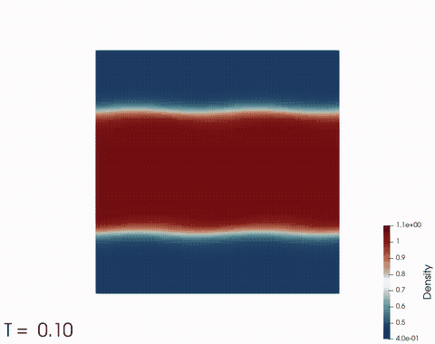

Transonic NACA0012 with adaptive refinement         |  Viscous NACA0012 with Recirculation bubble (Swanson) | Kelvin-Helmholtz Instability
:-------------------------:|:-------------------------:|:-------------------------: 
  |   | 


# Table of Contents

- [Parallel High-Order Library for PDEs](#parallel-high-order-library-for-pdes)
  * [Code Description](#code-description)
  * [Documentation](#documentation)
  * [Building and Running the Code](#building-and-running-the-code)
    + [Build using CMake](#build-using-cmake)
    + [Compile using Make](#compile-using-make)
  * [Testing](#testing)
  * [Debugging](#debugging)
  * [Performance](#performance)
  * [Contributing checklist](#contributing-checklist)
- [License](#license)


# Parallel High-Order Library for PDEs

[](https://codedocs.xyz/dougshidong/PHiLiP/)
[](https://zenodo.org/badge/latestdoi/162186347)


The [P]arallel [Hi]gh-Order [Li]brary for [P]DEs (PHiLiP) uses Discontinuous Galerkin methods to solve convection-diffusion problems.

The math supporting this code can be viewed in this **very rough draft in progress** [Overleaf document](https://www.overleaf.com/read/mytvbbbbyqnj).

## Code Description
- Code uses deal.II library as the backbone (https://www.dealii.org/)
- Parallelized through MPI
- Supports weak and strong (InProgress) form of discontinuous Galerkin (DG), and flux reconstruction (FR) (InProgress)
- Supported Partial Differential Equations: Linear advection, diffusion, convection-diffusion, Burgers, Euler, Navier-Stokes.
- Supported convective numerical fluxes: Lax-Friedrichs, Roe (Harten's entropy fix) for Euler, InProgress: Split-Form
- Supported diffusive numerical fluxes: Symmetric Interior Penalty, Bassi-Rebay's 2nd formulation (BR2)
- Supported elements: LINEs, QUADs, HEXs since it uses deal.II
- Supported refinements: h (size) or p (order) (InProgress).

## Documentation

The code itself is documented using Doxygen, and the latest documentation is hosted on [codedocs.xyz](https://codedocs.xyz/dougshidong/PHiLiP/). 

Since deal.II is heavily used, their [documentation](https://www.dealii.org/developer/doxygen/deal.II/index.html) is probably the most useful.

Another great resource is the [deal.II Google Groups](https://groups.google.com/forum/#!forum/dealii), where developers are actively answering questions.

Finally, I am also always available to answer questions regarding the code by e-mail at doug.shi-dong@mail.mcgill.ca

## Building and Running the Code

The code has been succesfully built in the following environments:
- linux (ubuntu 20.04 and later);

Please consult the [installation instructions](INSTALL.md) for details concerning required software.

### Failing tests

Since this library is developed by graduate students at McGill, there will always be sections that are work-in-progress. Some tests currently fail and are left here as part of "to-do" fixes. Therefore, if you experience any issues with tests, please consult the following list of known test failures.
https://github.com/dougshidong/PHiLiP/issues?q=is%3Aissue+is%3Aopen+label%3Atestfail

### Build using CMake

This must be build out-of-source. An in-source build is likely to fail. For example, to configure for the debug build:
```sh
$ ROOT$ export PHILIP_DIR=/path_to_PHiLiP/
$ ROOT$ mkdir build_debug
$ ROOT$ cd build_debug
$ ROOT$ cmake -DDEAL_II_DIR=/path_to_dealii_install/ $PHILIP_DIR
```

### Compile using Make

Once the code has been successfully built, the available `make` targets can be seen using
```sh
ROOT$ make help
```

Of primary interest are the following:
```sh
ROOT$ make -j2     // Compile the entire code, 1D, 2D, and 3D
ROOT$ make -j2 doc // Generate the Doxygen documentation.
ROOT$ make -j2 1D  // Compile the 1D version of the code
ROOT$ make -j2 2D  // Compile the 2D version of the code
ROOT$ make -j2 3D  // Compile the 3D version of the code
```

Based on past experiences, you might want to limit the number of processor to 2 or 3 (make -j 3) if you have 8GB of RAM.

The html documentation can be accessed by pointing a browser at `ROOT/doc/html/index.html`. e.g. `google-chrome ROOT/doc/html/index.html`.

## Testing

A list of currently known failing tests is kept in the [GitHub issues](https://github.com/dougshidong/PHiLiP/issues?q=is%3Aissue+is%3Aopen+label%3Atestfail) with `testfail` tags.

Testing can be performed using CMake's `ctest` functionality. After successfully compiling the project, all tests can be
run by executing:
```sh
$ ROOT$ ctest (which is equivalent to ROOT$ make test)
```

An alternative make target is provided to run tests with --output-on-failure:
```sh
ROOT$ make check
```

Additional useful commands are:
```sh
ROOT$ ctest -N (List the tests that would be run but not actually run them)
ROOT$ ctest -R <regex> (Run tests matching regular expression)
ROOT$ ctest -E <regex> (Exclude tests matching regular expression)
ROOT$ ctest -V (Enable verbose output from tests)
ROOT$ ctest -L <label> (Run tests matching label)
ROOT$ ctest -LE <label> (Exclude tests matching label)
```
Note that running `ctest` in `Debug` will take forever since some integration tests fully solve nonlinear problems with multiple orders and multiple meshes. It is suggested to perform `ctest` in `Release` mode, and only use `Debug` mode for debugging purposes.

More detail about running tests using labels can be found [here](tests/CTEST_LABELS.md).

## Debugging

Please consult the [debugging quick start guide](DEBUG.md) for details concerning both serial and parallel debugging.

## Performance

Please consult the [performance inspection quick start guide](PERFORMANCE.md) for details concerning computational bottlenecks, memory leaks, and memory usage. 

## Contributing checklist

Please consult the [contributing checklist](CONTRIBUTE.md) for details concerning making a contribution.

# License

The code is licensed under the [GNU LGPLv2.1](LICENSE.md) due to the dependence on the deal.II library.

